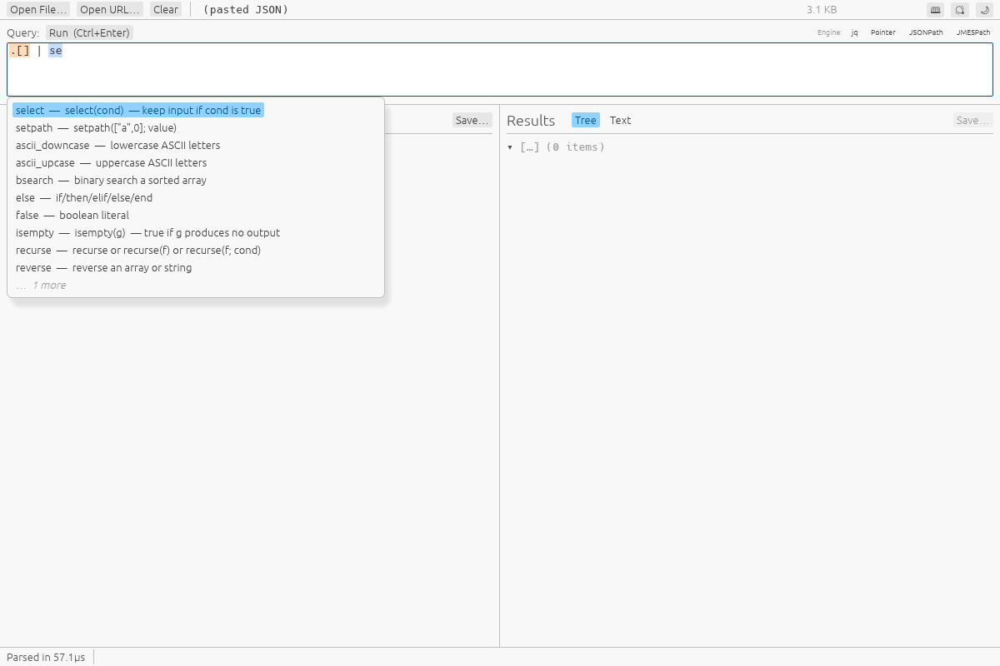
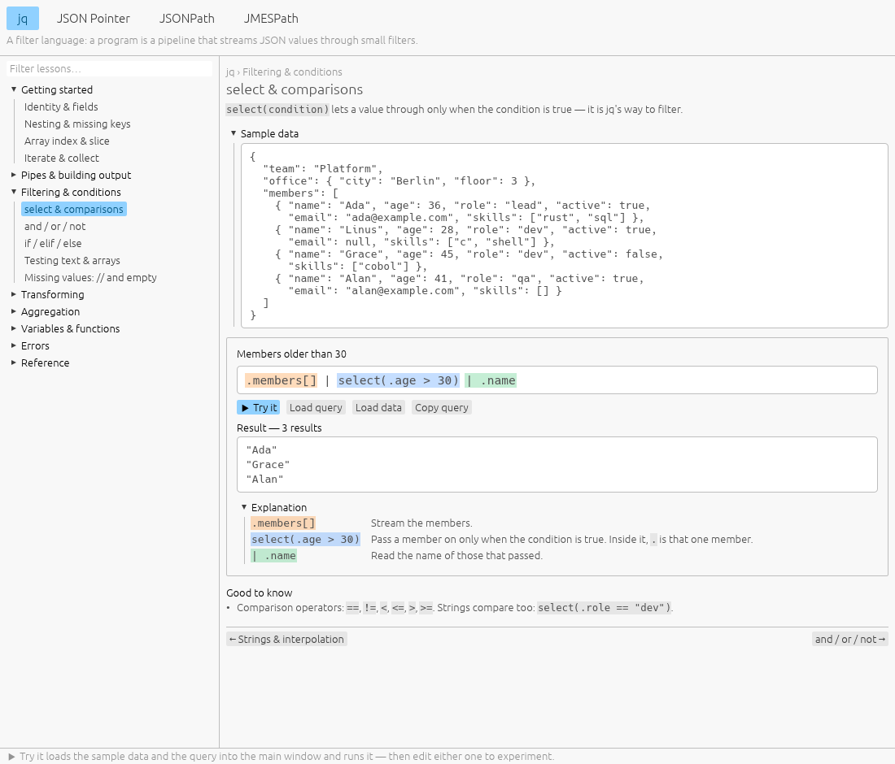
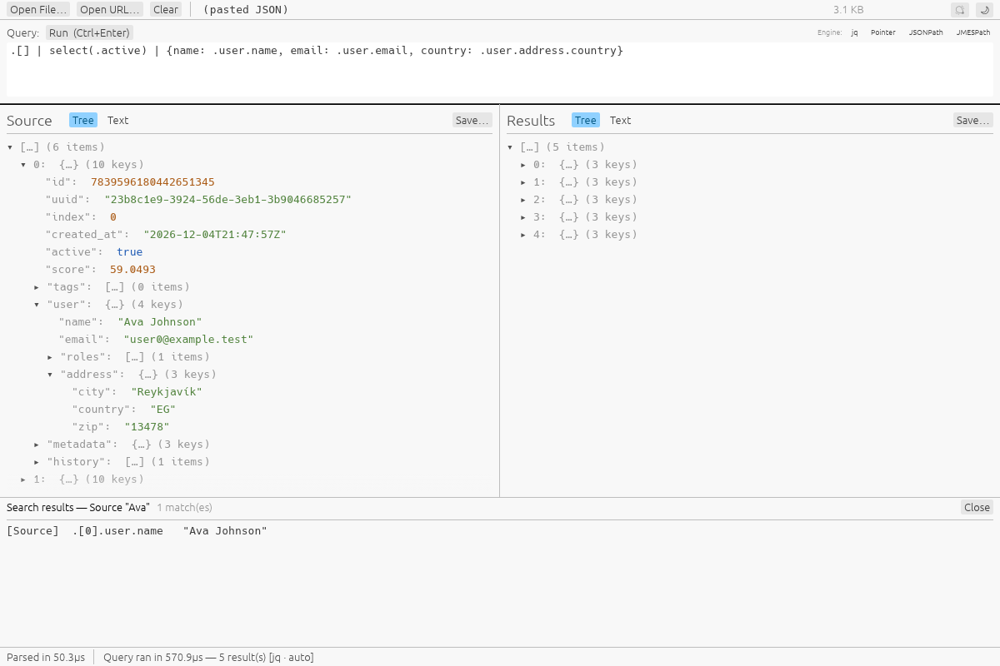

# jsonquery gui

A native desktop tool for browsing and querying large JSON files — drag in a
file (or paste JSON directly) and query it with **jq**, **JSON Pointer**,
**JSONPath**, or **JMESPath**. Built in Rust with
[egui](https://github.com/emilk/egui)/[eframe](https://github.com/emilk/egui).


## Features

- **Four query dialects, one box** — [jq](https://jqlang.github.io/jq/) (via
  embedded [jaq](https://github.com/01mf02/jaq)), JSON Pointer (RFC 6901),
  JSONPath (RFC 9535), and JMESPath. Pick one from the toolbar or let the app
  auto-detect it from what you type.
- **Inline autocomplete** — as-you-type suggestions for each dialect's
  built-in functions (with a short doc string) and for the loaded document's
  own keys and array indices — type `.` or `[` to see what's there. In jq it
  follows pipes and calls too: inside `.members | map(select(.` it offers the
  fields of each member. Accepted text is spelled for the dialect
  (`.["first name"]` in jq, `$["first name"]` in JSONPath, `."first name"` in
  JMESPath). Off by default — switch it on with the 💡 button in the toolbar.

  
- **Colour-coded queries** — the query box tints each step of what you type
  (`.members`, `[]`, `select(…)`, `.name`; a Pointer's `/segments`) in the same
  palette the tutorial uses, leaving pipes, commas and operators plain, so a
  long query's structure is visible at a glance. It follows the selected
  dialect and copes with half-typed queries.
- **Built-in tutorial** — the 📖 icon in the toolbar (or `F1`) opens a
  separate window with a lesson tree for each dialect. Every lesson has short
  examples with the query broken down piece by piece and a live result;
  **▶ Try it** loads an example's data and query into the main window so you
  can edit and experiment. See [Tutorial](docs/tutorial.md).

  
- **Streamed, cancellable queries** — results appear as jq produces them, so
  `first(...)`/`limit(...)` genuinely stop early; starting a new query aborts
  whatever was still running.
- **Exact number round-tripping** — big integers (snowflake IDs, Postgres
  bigints) survive a query byte-for-byte instead of quietly rounding through
  an `f64`.
- **NDJSON support** — one JSON value per line loads as a single queryable
  document, no separate format to pick.
- **Tree or raw text views** — toggle either the source document or the
  query results between a virtualized, expand/collapse tree and
  plain, selectable/copyable pretty-printed text.
- **Search** — `Ctrl+F` opens a Notepad++-style Find dialog with the cursor
  already in its field: a case-insensitive substring or regex search across
  the source or the results tree. **Find** (or `Enter`) jumps to each match in
  turn — expanded, scrolled to and highlighted — with a running "3 of 17",
  wrapping past the last one; **Find All** lists every match in a panel below,
  where a click reveals it.

  
- **Find in Source** — right-click a result row to see where it came from.
  The row's key and value are matched against the source, and for array
  elements their position: one hit is revealed directly, several are listed
  with the best guess selected, and a computed value falls back to a text
  search.
- **Right-click row menus** — copy a node's path, search from that scope,
  save just that node to a file, or expand a whole subtree at once.
- **Save to file** — the whole source document, the whole result set, or a
  single node, independently.
- **Load however's convenient** — drag-and-drop, a **Source** field that
  takes a URL or a local path (type it or paste it, or browse with **…**),
  or pasting JSON straight into the text area.
- **Light and dark themes**, switchable from the toolbar.
- **Keyboard shortcuts** — `Ctrl+Enter` run/apply, `Ctrl+F` search,
  `Ctrl+S` save (both scoped to whichever panel you last clicked), `F1`
  tutorial.

## Known limitations

- **Drag-and-drop doesn't work on native Wayland** — a gap in
  [`winit`](https://github.com/rust-windowing/winit) (`eframe`'s windowing
  library), which only implements OS-level file drop on Windows, macOS, and
  X11 ([rust-windowing/winit#1881](https://github.com/rust-windowing/winit/issues/1881)).
  The **Source** field (and its **…** file picker) and pasting both work fine
  everywhere. Workaround: run under XWayland instead (if `DISPLAY` is set,
  it's available):
  ```sh
  WAYLAND_DISPLAY= cargo run --release -p jsonquery_gui
  ```
- Multi-gigabyte files are not yet backed by a memory-mapped, lazily-resolved
  index, so very large documents load fully into memory. See
  [Scaling beyond in-memory](docs/architecture.md#scaling-beyond-in-memory).

## Getting started

### Homebrew (Linux)

```sh
brew tap nujufas/jsonquery-gui
brew install jsonquery-gui
```

macOS builds aren't published yet, so the tap is Linux-only for now. If
Homebrew refuses the formula as an untrusted tap, run
`brew trust nujufas/jsonquery-gui` first.

### Snap (Linux)

```sh
sudo snap install jsonquery-gui
```

Also available on the [Snap Store](https://snapcraft.io/jsonquery-gui), for
both x86-64 (amd64) and ARM (arm64) machines. The snap is sandboxed: it reads
files in your home folder directly. For files on an external drive or under
`/mnt`, run `sudo snap connect jsonquery-gui:removable-media` once (the **…**
file picker works for any file without it).

### Scoop (Windows)

```pwsh
scoop bucket add jsonquery-gui https://github.com/nujufas/scoop-jsonquery-gui
scoop install jsonquery-gui/jsonquery-gui
```

This installs the release's Windows zip with a Start-menu shortcut and a
`jsonquery-gui` command; `scoop update jsonquery-gui` follows new releases. The
executable is not code-signed, so Windows SmartScreen may warn the first time
it runs. Packaging notes: [`packaging/scoop/`](packaging/scoop/).

### Download a build

Prebuilt Linux and Windows binaries are attached to each
[GitHub Release](https://github.com/nujufas/jsonquery_gui/releases). An AUR
package (`jsonquery-gui-bin`) is also available for Arch-based distros — see
[`packaging/aur/`](packaging/aur/). You can also build everything yourself
with the scripts in [`build/`](build/) — see [Building](#building) below.

### Build from source

Requires a [Rust toolchain](https://rustup.rs/) (stable).

```sh
git clone https://github.com/nujufas/jsonquery_gui.git
cd jsonquery_gui
cargo run --release -p jsonquery_gui
```

## Usage

1. Get JSON in: drag a file onto the window, type or paste a URL or file path
   into the **Source** field and press **Load** (**…** browses for a file), or
   paste JSON into the text area.
2. Pick a query engine (or leave it on auto-detect) and write a query, e.g.
   `.users[] | select(.active) | {name, roles}` for jq, `/users/0` for
   Pointer, `$.users[*].name` for JSONPath, or `users[?active].name` for
   JMESPath. New to one of them? The 📖 tutorial has short lessons for all
   four.
3. Press **Run** (or `Ctrl+Enter`). Results stream into the right-hand
   panel — toggle it between **Tree** and **Text**, search it, or save it.

## Building

Native release build for the current platform:

```sh
cargo build --release -p jsonquery_gui
# binary at target/release/jsonquery_gui
```

Cross-platform packaged builds live in [`build/`](build/), output to `dist/`:

```sh
build/linux.sh      # native release build -> .tar.gz
build/appimage.sh   # native release build -> self-integrating .AppImage
build/linux.sh aarch64      # arm64 .tar.gz, cross-compiled via `cross`/Docker
build/appimage.sh aarch64   # arm64 .AppImage, likewise
build/windows.sh    # cross-compiled via `cross`/Docker -> .zip
build/all.sh        # all of the above, plus a listing of dist/
build/snap.sh       # sandboxed build via snapcraft -> dist/*.snap
```

`build/windows.sh` and the `aarch64` builds need a working Docker daemon (they
cross-compile inside a container with the toolchain already installed; the
aarch64 image links an old glibc, so those binaries also run on older distros
than a native build would). `build/appimage.sh` downloads `appimagetool` on
first use and needs FUSE to run it. On an actual Windows machine,
`build\windows.bat` builds natively instead — same output layout, just needs a
Rust toolchain and PowerShell.

The AppImage is desktop-pinnable out of the box: it self-registers a
`.desktop` entry and icon on first launch (no `appimaged`/AppImageLauncher
required), so right-click → Pin works from the taskbar/dock immediately.

`build/snap.sh` needs `snapcraft` plus a multipass or LXD build backend. It
isn't wired into `build/all.sh` — it builds in its own sandbox and isn't
needed for the tarball/AppImage/Windows release artifacts. See
[`packaging/snap/`](packaging/snap/) for build/test/publish details.

## Development

```sh
cargo test --workspace     # unit tests (core parsing/tree logic, query engines)
cargo clippy --workspace --all-targets
```

The workspace is split into three crates so the non-GUI logic can be tested
without pulling in a GUI toolkit:

- **`crates/core`** — file ingest (mmap + parse) and the virtualized-tree data layer.
- **`crates/query`** — the four query engines, dispatched through a shared `QueryEngine` trait.
- **`crates/app`** — the eframe/egui application itself.

A Robot Framework GUI test suite (screen-driven, OCR-assisted) lives under
[`test/`](test/README.md) — see that README for how to run it.
[`scripts/gen_test_data.py`](scripts/gen_test_data.py) generates large
synthetic JSON/NDJSON files (with unicode and 19-digit integer ids) for
exercising the app by hand.

## Architecture

The design — pipeline, concurrency model, crate layout — is written up in
[`docs/`](docs/index.md):

- [`docs/index.md`](docs/index.md) — problem statement, goals, high-level shape.
- [`docs/architecture.md`](docs/architecture.md) — the full system design.
- [`docs/query-engines.md`](docs/query-engines.md) — the query-dialect landscape and why these four were picked.

## License

[MIT](LICENSE)

Built with the help of [Claude](https://claude.com) — see
[`docs/`](docs/index.md) for the architecture docs behind it.
