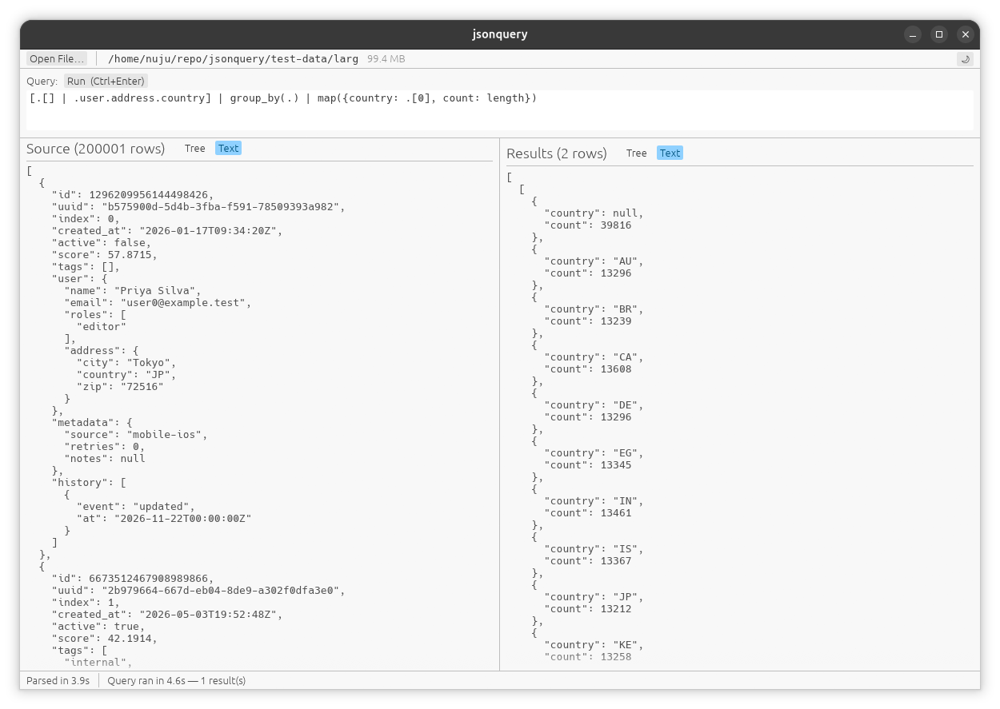

# jsonquery

A native desktop tool for browsing and querying large JSON files — drag in a
file (or paste JSON directly), write a [jq](https://jqlang.github.io/jq/)
compatible query, and see the result as a scrollable tree. Built in Rust with
[egui](https://github.com/emilk/egui)/[eframe](https://github.com/emilk/egui).



## Built by AI

This project — the code, the architecture docs, and the build tooling — was
built by [Claude](https://claude.com) (Anthropic's AI), working from a series
of prompts by the repo owner. It's as much an experiment in AI-driven
software development as it is a JSON tool. The [architecture proposal and
decision docs](docs/index.html) capture the reasoning behind the design
choices along the way — open them locally in a browser to read them rendered
(GitHub shows `.html` files as source, not as pages).

## Status

**Phase 1 (MVP)** is implemented: full in-memory parsing, jq-compatible
queries via an embedded [jaq](https://github.com/01mf02/jaq), and a
virtualized-tree GUI for both the source document and query results. It's
solid for small-to-medium files.

Multi-gigabyte files need Phase 2 (a memory-mapped, lazily-resolved index),
which isn't built yet. See [`docs/decisions.html`](docs/decisions.html) for
the full roadmap and the reasoning behind what's built vs. deferred.

## Known limitations

- **Drag-and-drop doesn't work on native Wayland.** This is a gap in
  [`winit`](https://github.com/rust-windowing/winit) (the windowing library
  `eframe` uses), which only implements OS-level file drop events on
  Windows, macOS, and X11 —
  [rust-windowing/winit#1881](https://github.com/rust-windowing/winit/issues/1881)
  tracks it upstream. **Open File…** and pasting JSON directly both work
  fine everywhere. As a workaround, run under XWayland instead of native
  Wayland (if `DISPLAY` is set, XWayland is available) and drag-and-drop
  starts working:
  ```sh
  WAYLAND_DISPLAY= cargo run --release -p jsonquery_gui
  ```

## Features

- **Open large-ish files fast** — memory-mapped, no upfront full-file copy.
- **jq-compatible queries** — a real jq implementation ([jaq](https://github.com/01mf02/jaq)) embedded directly, not a reinvented query language.
- **Streamed results** — results are pushed to the UI as jaq produces them, so `first(...)`/`limit(...)` genuinely stop early instead of running to completion in the background.
- **Exact number round-tripping** — big integers (snowflake IDs, Postgres bigints) survive a query byte-for-byte instead of quietly rounding through an `f64`.
- **NDJSON support** — a file with one JSON value per line is treated as a single queryable document, no separate "format" to pick.
- **Cancellable queries** — start a new query and the previous one is aborted, not queued behind it.
- **Drag-and-drop, file picker, or paste** — drop a file anywhere in the window, use **Open File…**, or just paste JSON into the text area and it loads immediately.
- **Tree or raw text results** — toggle the results panel between the virtualized tree and plain pretty-printed text you can select and copy with the mouse.
- **Light and dark themes** — switchable from the toolbar.

## Getting started

### Download a build

Prebuilt Linux and Windows binaries can be produced with the scripts in
[`build/`](build/) — see [Building](#building) below. (No binary releases are
published yet; build from source in the meantime.)

### Build from source

Requires a [Rust toolchain](https://rustup.rs/) (stable).

```sh
git clone <this repository's URL>
cd jsonquery
cargo run --release -p jsonquery_gui
```

## Usage

1. Get JSON in: drag a file onto the window, use **Open File…**, or paste
   JSON straight into the text area on the left — it loads as soon as you
   paste, no extra step.
2. Write a query in the bar at the top — plain jq syntax, e.g.:
   ```
   .users[] | select(.active) | {name, roles}
   ```
3. Press **Run** (or `Ctrl+Enter`). Results stream into the right-hand panel.
   Switch it between **Tree** (virtualized, expand/collapse) and **Text**
   (plain, selectable/copyable pretty-printed JSON) with the toggle above it.

## Building

Native release build for the current platform:

```sh
cargo build --release -p jsonquery_gui
# binary at target/release/jsonquery_gui
```

Cross-platform packaged builds live in [`build/`](build/), output to `dist/`:

```sh
build/linux.sh      # native release build -> .tar.gz
build/appimage.sh   # native release build -> self-integrating .AppImage
build/windows.sh    # cross-compiled via `cross`/Docker -> .zip
build/all.sh         # all three, plus a listing of dist/
```

`build/windows.sh` needs a working Docker daemon — it cross-compiles inside a
container that already has the mingw-w64 toolchain, so nothing is installed
on the host. `build/appimage.sh` downloads `appimagetool` on first use
(cached in `build/`) and needs FUSE to run it.

On an actual Windows machine, skip the cross-compile and build natively
instead:

```bat
build\windows.bat   # native release build -> .zip
```

Same output layout as the other scripts (`dist\jsonquery_gui-<version>-windows-x86_64.zip`).
Just needs a Rust toolchain and PowerShell (bundled since Windows 10 /
Server 2016) to create the zip.

The AppImage is desktop-pinnable out of the box: on first launch it registers
a `.desktop` entry and icon under `~/.local/share` (no `appimaged` /
AppImageLauncher required), and the window's app ID matches
`StartupWMClass` in that entry, so window managers correctly associate the
running window with the launcher icon — right-click it in the
taskbar/dock and "Pin" works as expected.

## Development

```sh
cargo test --workspace     # unit tests (core parsing/tree logic, query engine)
cargo clippy --workspace --all-targets
```

The workspace is split into three crates so the non-GUI logic can be tested
and benchmarked without pulling in a GUI toolkit:

- **`crates/core`** — file ingest (mmap + parse) and the virtualized-tree data layer.
- **`crates/query`** — the embedded jaq query engine and its `serde_json::Value ⇄ jaq_json::Val` conversion.
- **`crates/app`** — the eframe/egui application itself.

### Test data

[`scripts/gen_test_data.py`](scripts/gen_test_data.py) generates a large
synthetic JSON (or NDJSON) file for exercising the app — nested objects,
unicode, and 19-digit integer ids that exceed `f64`'s exact-integer range, to
exercise the number round-tripping:

```sh
scripts/gen_test_data.py                                    # ~200k records to test-data/large.json
scripts/gen_test_data.py --target-size 1GB -o test-data/big.json
scripts/gen_test_data.py --format ndjson -n 1000000 -o test-data/events.ndjson
```

Each run also prints a handful of jq queries worth trying against the file it
just generated (filtering, nested-field access, aggregation with
`group_by`, and one that highlights the exact-integer round-tripping) —
see `SAMPLE_QUERIES` in the script, kept next to the record shape it
describes so the two can't drift apart.

## Architecture

The design — pipeline, indexing strategy, concurrency model, crate layout —
is written up in [`docs/`](docs/index.html):

- [`docs/index.html`](docs/index.html) — problem statement, goals, high-level shape.
- [`docs/architecture.html`](docs/architecture.html) — the full system design.
- [`docs/decisions.html`](docs/decisions.html) — the decisions that shaped the build, open risks, and the roadmap.

(Open these locally in a browser — GitHub renders `.html` files as source, not as pages.)

## License

[MIT](LICENSE)
