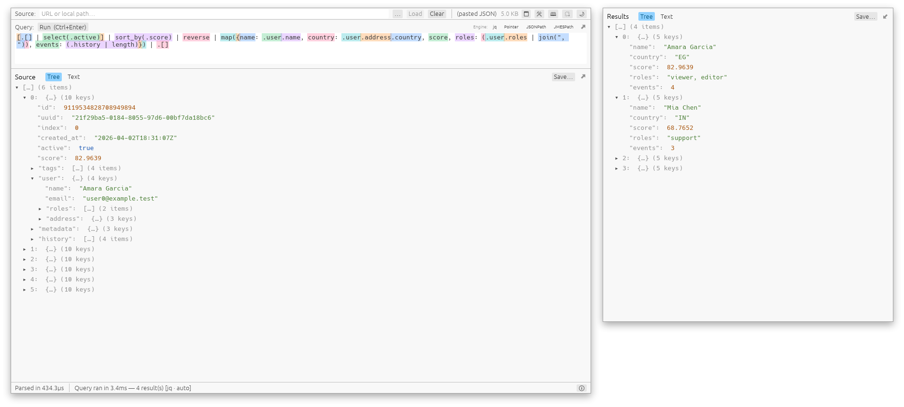
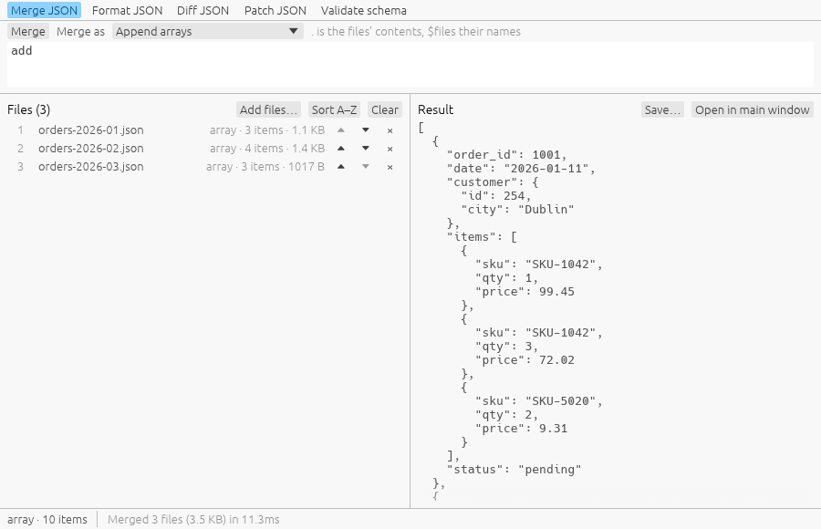
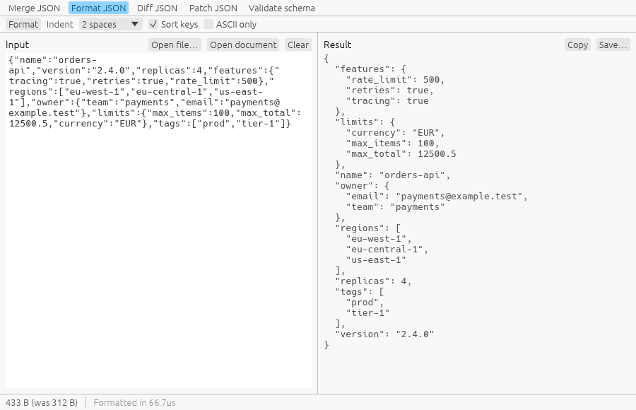
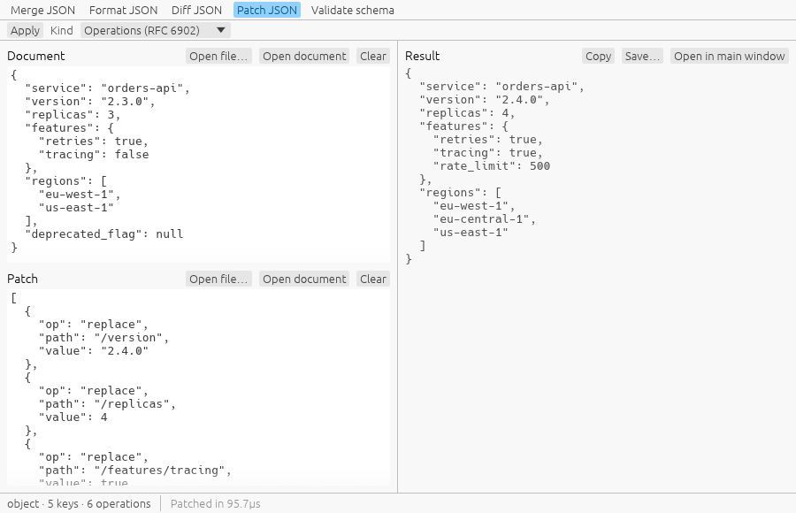
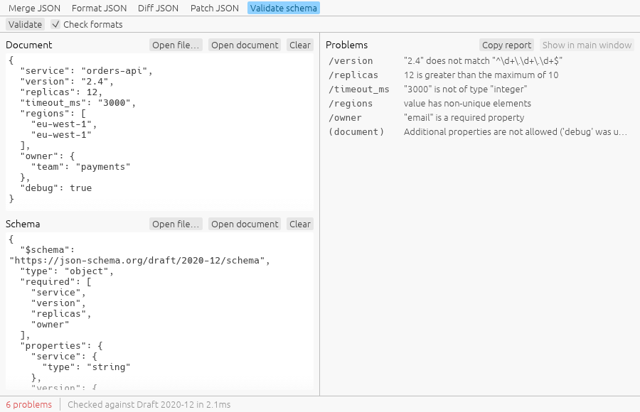

# jsonquery gui

A native desktop tool for browsing and querying large JSON files — drag in a
file (or paste JSON directly) and query it with **jq**, **JSON Pointer**,
**JSONPath**, or **JMESPath**. A **Tools** window merges, formats, diffs,
patches and validates documents too. Built in Rust with
[egui](https://github.com/emilk/egui)/[eframe](https://github.com/emilk/egui).


## Features

- **Four query dialects, one box** — [jq](https://jqlang.github.io/jq/) (via
  embedded [jaq](https://github.com/01mf02/jaq)), JSON Pointer (RFC 6901),
  JSONPath (RFC 9535), and JMESPath. Pick one from the toolbar or let the app
  auto-detect it from what you type.
- **Inline autocomplete** — as-you-type suggestions for each dialect's
  built-in functions (with a short doc string) and for the loaded document's
  own keys and array indices — type `.` or `[` to see what's there, with a
  sample value next to each key. In jq it follows pipes and calls too: inside
  `.[] | select(.` it offers the fields of each record. Accepted text is
  spelled for the dialect (`.["first name"]` in jq, `$["first name"]` in
  JSONPath, `."first name"` in JMESPath). Off by default — switch it on with
  the 💡 button in the toolbar.

  
- **Colour-coded queries** — the query box tints each step of what you type
  (`.[]`, `select(…)`, `sort_by(…)`, `.user.name`; a Pointer's `/segments`)
  in the same palette the tutorial uses, leaving pipes, commas and operators
  plain, so a long query's structure is visible at a glance — see the query
  at the top of this page. A call inside a call gets its own tint, the
  colours follow the selected dialect, and half-typed queries are fine.
- **Built-in tutorial** — the 📖 icon in the toolbar (or `F1`) opens a
  separate window with a lesson tree for each dialect. Every lesson has short
  examples with the query broken down piece by piece and a live result;
  **▶ Try it** loads an example's data and query into the main window so you
  can edit and experiment. See [Tutorial](docs/tutorial.md).

  
- **Tools** — the 🛠 icon next to the tutorial opens the Tools window, with a
  tab for each of five utilities that go with the viewer: **Merge JSON**,
  **Format JSON**, **Diff JSON**, **Patch JSON** and **Validate schema**. Each
  is shown in action under [Tools](#tools) below.
- **Streamed, cancellable queries** — results appear as jq produces them, so
  `first(...)`/`limit(...)` genuinely stop early; starting a new query aborts
  whatever was still running.
- **Exact number round-tripping** — big integers (snowflake IDs, Postgres
  bigints) survive a query byte-for-byte instead of quietly rounding through
  an `f64`.
- **NDJSON support** — one JSON value per line loads as a single queryable
  document, no separate format to pick.
- **Tree or raw text views** — toggle either the source document or the
  query results between a virtualized, expand/collapse tree and
  plain, selectable/copyable pretty-printed text.
- **CSV and TSV out** — end a jq query with `@csv` or `@tsv`, for example
  `.[] | [.name, .age] | @csv`, and the results are rows of text:
  **Copy to Clipboard**, **Save…** and the Text view write them as CSV or TSV,
  a line per result, not as quoted JSON strings. A `CSV`/`TSV` note beside the
  Tree and Text buttons says when that applies. (jaq has neither filter;
  jsonquery adds them, with `IN`, `INDEX`, `JOIN`, `tostream`, `fromstream`
  and `truncate_stream`.) The tutorial teaches them on the pages of its
  *Tables & lookups* and *Event streams* topics.
- **Search** — `Ctrl+F` opens a Notepad++-style Find dialog with the cursor
  already in its field: a case-insensitive substring or regex search across
  the source or the results tree. **Find** (or `Enter`) jumps to each match in
  turn — expanded, scrolled to and highlighted — with a running "2 of 3",
  wrapping past the last one; **Find All** lists every match in a panel below,
  where a click reveals it.

  
- **Find in Source** — right-click a result row to see where it came from.
  The row's key and value are matched against the source, and for array
  elements their position: one hit is revealed directly, several are listed
  with the best guess selected, and a computed value falls back to a text
  search.
- **Right-click row menus** — copy a node's path or its JSON to the
  clipboard, search from that scope, save just that node to a file, or
  expand a whole subtree at once.
- **Save to file** — the whole source document, the whole result set, or a
  single node, independently.
- **Load however's convenient** — drag-and-drop (several files at once are
  offered to **Merge JSON**), a **Source** field that takes a URL or a local
  path (type it or paste it, or browse with **…**), or pasting JSON straight
  into the text area.
- **Resizable query box that scrolls** — drag the query panel's bottom edge to
  make it any height; a long query scrolls inside it (the cursor stays in
  view) instead of taking over the window.
- **Pop-out panes** — the Query, Source and Results panes each have a small
  **⬈** icon in the top right corner of their header that opens the pane in a
  window of its own — a big query on a second monitor, or the results beside a
  full-height source. The main window gives the room to whatever is left. The
  **⬋** icon in that window, or just closing it, docks the pane back, and a
  **🗖** button in the toolbar (there while anything is out) brings every
  window back at once. The Source pane's window has a **Source** field of its
  own on top (with **…**, **Load** and **Clear**), so a document can be opened
  from there. Shortcuts and search work in each window.

  
- **Light and dark themes**, switchable from the toolbar.
- **Settings and a memory** — the ⚙ at the right end of the status bar opens a
  small window with the **limit on file sizes** that matters: from what size a
  file is memory-mapped and kept on disk instead of being loaded. Under
  *Advanced* are the others: how much the Tools window takes, how big a
  download or a copy may be, how much a query on a huge file may hold. Hover a
  name for what it does and its default, which is what the app has always used.
  The app also starts as you left it: the theme, whether autocomplete is on, the
  size of the window (maximized or not) and of its panes. All of it is in one
  small file, `~/.jsonquery/settings.json`. See [docs/settings.md](docs/settings.md).
- **Keyboard shortcuts** — `Ctrl+Enter` run/apply, `Ctrl+F` search,
  `Ctrl+S` save (both scoped to whichever panel you last clicked), `F1`
  tutorial.

## Tools

The 🛠 icon in the toolbar opens the **Tools** window: five small utilities,
each on a tab of its own, laid out like the main window — a command row with
the tool's main button and its options, what goes in on the left, what came
out on the right, and a status bar that says what happened. JSON goes into a
box by pasting, by dropping a file on the window, with **Open file…**, or with
**Open document** (the one in the main window). A result can be copied, saved,
or opened in the main window as a document of its own, to query like any
other. `Ctrl+Enter` runs the tab's main button and **Cancel** stops a job. The
tools work in memory, so they are for documents that are not very large (what
a run is given may add up to 128 MB, which is a setting). Details in
[docs/tools.md](docs/tools.md).

### Merge JSON

Combines several files into one document with a jq filter, the way `jq -s`
does: the files are read in the order listed and slurped into one array, which
is the filter's input, and `$files` holds their names. Drop the files on the
window (or several at once on the main window), or press **Add files…**; pick a
ready-made filter from **Merge as** — append arrays, append sorted and
de-duplicated, deep-merge objects, bundle by file name — or edit it into your
own, and press **Merge**. The result can be saved, or opened in the main
window.



### Format JSON

Pretty-prints with 2 or 4 spaces or a tab, minifies, sorts the keys at every
depth, and can write everything outside ASCII as `\uXXXX` escapes. Numbers come
out exactly as they went in, however many digits they have.



### Diff JSON

Compares a Left and a Right document the way a file-comparison tool does.
**Side by side** shows both pretty-printed, line by line: what only Left has in
red, what only Right has in green, what changed in amber with the differing
characters picked out. The sides scroll together, the strip at the right edge
has a tick for every difference, ▲/▼ (`Alt+Up`, `Alt+Down`) step through them,
and **Differences only** folds what is the same. Its tab compares the two
documents by itself — **Compare** is for comparing again. **Changes** lists each
change with its JSON Pointer, and **Patch** is the RFC 6902 JSON Patch that turns
Left into Right — **Copy patch** or **Save patch…** it. Key order is not a
difference, numbers are compared by value with their exact digits, and arrays
are aligned by content, so an inserted element is one change rather than a
change to every element after it.

Each difference has two arrows between the sides, one over the other, at its first
line: press one and the document it points at takes what the other has there, as a
file-comparison tool's "copy to left/right" does; the comparison runs again and the
view stays where it was. Not the whole difference? Click a line to pick it
(`Ctrl` adds one, `Shift` picks a run, a drag runs over several, `Esc` lets go):
the arrows, **⏴** and **⏵** (`Alt+Left`, `Alt+Right`) and the right-click menu of a
line then move only the lines picked. Either side can also be edited in place:
double-click a line to put a caret in it — type, press `Enter`, and what you
typed (a value, a member, nothing to take the line out, several to put them in) is
in the document and compared again. A document that a move or an edit changed says
so, and the **Save…** over its column writes it to a file — either, or both.


### Patch JSON

Applies an RFC 6902 JSON Patch (a list of operations) or an RFC 7386 JSON Merge
Patch to a document. A patch is all or nothing, and an error names the
operation that failed.



### Validate schema

Checks a document against a JSON Schema (drafts 4, 6, 7, 2019-09 and 2020-12,
read from `$schema`) and lists every problem with its pointer and what is
wrong. For the document that is open in the main window, **Show in main
window** reveals a problem there. Nothing is ever fetched: a `$ref` has to
point inside the schema.



## Known limitations

- **Drag-and-drop doesn't work on native Wayland** — a gap in
  [`winit`](https://github.com/rust-windowing/winit) (`eframe`'s windowing
  library), which only implements OS-level file drop on Windows, macOS, and
  X11 ([rust-windowing/winit#1881](https://github.com/rust-windowing/winit/issues/1881)).
  The **Source** field (and its **…** file picker), the Tools window's **Add
  files…** and **Open file…** buttons and pasting all work fine everywhere.
  Workaround: run under XWayland instead, one click away once it is set up;
  see [Dropping files on a Wayland desktop](#dropping-files-on-a-wayland-desktop).
- **Pop-out windows open wherever the compositor puts them on native
  Wayland** — `winit` can neither set nor read a window's position there, so
  a popped-out pane can't open over the spot it left or reopen where you
  moved it. (Windows, macOS and X11 can; only X11 has been tried — the
  XWayland entry above gets you there on a Wayland desktop.)
- **A file of 256 MiB or more is not parsed but kept on disk and read as you look
  at it** (that size is a setting; memory-mapped, and indexed once when it opens; a
  download and the result of a Merge that big are kept in a temporary file the same
  way), so that a gigabyte of
  JSON takes megabytes, not the twelve to seventeen times its size that a parsed
  tree does. Long lists are shown in runs of a thousand; jq queries read the file
  as they go, so `.[] | select(…) | .name`, `map(…)`, `length`, `.[1234567]`,
  `first(…)`, `..`, `sort_by(…)`, `group_by(…)` and `min_by(…)` work on any size
  (a sort takes some memory for the keys, about the size of the file at the most),
  but a program that needs the whole of a list as a value (`add` on the document,
  `to_entries`, `flatten`) says so instead of running. JSONPath and JMESPath
  work the same way (`$[?(@.qty > 48)].id`, ``[?qty > `48`].id``), apart from
  functions that need a whole big list (`sort_by`, `max`). Format in the Tools
  window writes such a file indented or minified without holding it; the rest of
  the Tools window, and Copy of more than 64 MiB (a setting too), don't work on one, and the file
  should stay as it is while it is open (if another program
  cuts it short, the app says so and refuses to answer from what is gone, rather
  than closing). See
  [Scaling beyond in-memory](docs/architecture.md#scaling-beyond-in-memory).

## Getting started

### Homebrew (Linux)

```sh
brew tap nujufas/jsonquery-gui
brew install jsonquery-gui
```

macOS builds aren't published yet, so the tap is Linux-only for now. If
Homebrew refuses the formula as an untrusted tap, run
`brew trust nujufas/jsonquery-gui` first.

### Snap (Linux)

```sh
sudo snap install jsonquery-gui
```

Also available on the [Snap Store](https://snapcraft.io/jsonquery-gui), for
both x86-64 (amd64) and ARM (arm64) machines. The snap is sandboxed: it reads
files in your home folder directly. For files on an external drive or under
`/mnt`, run `sudo snap connect jsonquery-gui:removable-media` once (the **…**
file picker works for any file without it). To drop files on its window under
Wayland, see [Dropping files on a Wayland desktop](#dropping-files-on-a-wayland-desktop).

### Scoop (Windows)

```pwsh
scoop bucket add jsonquery-gui https://github.com/nujufas/scoop-jsonquery-gui
scoop install jsonquery-gui/jsonquery-gui
```

This installs the release's Windows zip with a Start-menu shortcut and a
`jsonquery-gui` command; `scoop update jsonquery-gui` follows new releases. The
executable is not code-signed, so Windows SmartScreen may warn the first time
it runs.

### Download a build

Prebuilt Linux and Windows binaries are attached to each
[GitHub Release](https://github.com/nujufas/jsonquery_gui/releases). An AUR
package (`jsonquery-gui-bin`) is also available for Arch-based distros. To
build the app yourself, see [Build from source](#build-from-source) below.

The AppImage is desktop-pinnable out of the box: it self-registers a
`.desktop` entry and icon on first launch (no `appimaged`/AppImageLauncher
required), so right-click → Pin works from the taskbar/dock immediately. It
embeds the static type 2 runtime (no libfuse2 needed to start it), carries
fallback copies of the xkbcommon libraries for systems that lack them, and
embeds update information, so AppImageUpdate (or a launcher built on it) can
fetch newer releases. On a Wayland desktop it also adds a **jsonquery (X11)**
entry, for dropping files on the window (see
[Dropping files on a Wayland desktop](#dropping-files-on-a-wayland-desktop)).

### Dropping files on a Wayland desktop

Most current Linux desktops (Ubuntu, Fedora and others) run Wayland, where
jsonquery can't take a file dropped on its window (see
[Known limitations](#known-limitations)). Everything else works. To be able to
drop files, start jsonquery under X11 instead (XWayland, which the desktop
provides on request). Which one you have:

```sh
echo $XDG_SESSION_TYPE    # wayland: read on. x11: nothing to do
```

What you need is a **jsonquery (X11)** entry in your application menu, next to
the regular **jsonquery**: click that one, and drop files on its window.

- **AppImage:** nothing to do. On a Wayland desktop the AppImage adds that entry
  by itself the first time you start it, and again if you move it or replace it
  with a newer one. (AppImages made before this was added don't: use the script
  below.) To get rid of it, delete
  `~/.local/share/applications/jsonquery-gui-x11.desktop`; it stays gone until
  you move or replace the AppImage.
- **Everything else** (the tar.gz, the snap, the Arch package, an older
  AppImage): [`scripts/jsonquery-x11.sh`](scripts/jsonquery-x11.sh) adds the
  entry (and, if you ask, a shortcut on the Desktop) with one command. The
  tar.gz has the script inside. For the others, the program carries it: when it
  is running on native Wayland, a **⚠** appears at the bottom right, next to the
  **ℹ**. Click it, then **Download jsonquery-x11.sh**, and choose where to save
  it; the popup then shows the command to run, with a **Copy command** button.
  Or download it yourself:

```sh
curl -fLO https://raw.githubusercontent.com/nujufas/jsonquery_gui/master/scripts/jsonquery-x11.sh
bash jsonquery-x11.sh              # add "jsonquery (X11)" to the application menu
bash jsonquery-x11.sh --desktop    # ... and put a shortcut on the Desktop too
```

Then press the Super key, type `jsonquery`, click **jsonquery (X11)**, and drop
files on its window.

- The script finds jsonquery by itself: the program next to it, the snap, or
  the Arch package. If you keep an AppImage somewhere, name it (make it
  executable first with `chmod +x`):
  `bash jsonquery-x11.sh ~/Apps/jsonquery_gui-0.5.0-x86_64.AppImage`
- **Moved or updated the program?** Run the script again; it rewrites the
  entry.
- `bash jsonquery-x11.sh run` starts jsonquery under X11 once, without adding
  anything; `remove` takes the entry and the shortcut away; `check` says what
  it found. On a desktop that is not Wayland the script does nothing.
- With no script at all, the same thing from a terminal: `env -u
  WAYLAND_DISPLAY -u WAYLAND_SOCKET jsonquery_gui` (for an AppImage, its file
  instead; the snap's program is `/snap/bin/jsonquery-gui`; from source,
  `env -u WAYLAND_DISPLAY -u WAYLAND_SOCKET cargo run --release -p jsonquery_gui`).
- It needs XWayland. If the script says `DISPLAY` is not set, your desktop has
  it switched off: look for an XWayland or "X11 apps" setting, then log in
  again.

### Build from source

Requires a [Rust toolchain](https://rustup.rs/) (stable).

```sh
git clone https://github.com/nujufas/jsonquery_gui.git
cd jsonquery_gui
cargo run --release -p jsonquery_gui
```

## Usage

1. Get JSON in: drag a file onto the window, type or paste a URL or file path
   into the **Source** field and press **Load** (**…** browses for a file), or
   paste JSON into the text area.
2. Pick a query engine (or leave it on auto-detect) and write a query, e.g.
   `.users[] | select(.active) | {name, roles}` for jq, `/users/0` for
   Pointer, `$.users[*].name` for JSONPath, or `users[?active].name` for
   JMESPath. New to one of them? The 📖 tutorial has short lessons for all
   four, and the 💡 autocomplete knows the document's keys.
3. Press **Run** (or `Ctrl+Enter`). Results stream into the right-hand
   panel — toggle it between **Tree** and **Text**, search it, pop it out
   into its own window, or save it.
4. To merge, format, diff, patch or validate documents instead, open the 🛠
   [Tools](#tools) window.

## Building

Native release build for the current platform:

```sh
cargo build --release -p jsonquery_gui
# binary at target/release/jsonquery_gui
```

## Development

```sh
cargo test --workspace     # unit tests: parsing and tree logic, the query engines and tools, headless window tests
cargo clippy --workspace --all-targets
```

The workspace is split into three crates so the non-GUI logic can be tested
without pulling in a GUI toolkit:

- **`crates/core`** — file ingest (parse, or mmap + index for a file of 256 MiB or more) and the virtualized-tree data layer.
- **`crates/query`** — the four query engines, dispatched through a shared
  `QueryEngine` trait, plus the merge, format, diff, patch and schema logic
  behind the Tools window.
- **`crates/app`** — the eframe/egui application itself.

### GUI tests: jsonquery_test

The end-to-end tests live in their own repository,
[**jsonquery_test**](https://github.com/nujufas/jsonquery_test). It is a
[Robot Framework](https://robotframework.org) suite that starts the real
application on a virtual X display of its own (Xvfb with the fluxbox window
manager, so it never touches your desktop), clicks and types into it the way a
person would, and reads the screen back with Tesseract OCR, pixel checks and
the clipboard — egui draws everything itself and has no accessibility tree to
query. As of October 2026 it has 612 test cases in 23 suites, one directory
per area of the app (launch and window, opening sources, the toolbar and
status bar, query engines, query highlighting, the query box, autocomplete,
tree and text views, context menus, search, saving, keyboard shortcuts,
pop-out panes, the Tools window, the tutorial and About windows, pane headers,
drag and drop, the jq functions the app adds, CSV and TSV output, the
tutorial's pages for them, the settings it keeps, and whole workflows from a
file to a saved file).
The file dialogs are answered by a stand-in for the desktop's file-chooser
portal, so the open and save cases run unattended too. Each area is specified
by a document in the suite's `docs/`, and a traceability matrix gives every
case's status with its reason.

It needs Linux, Python 3.12, a Rust toolchain and a few system packages
(`xvfb fluxbox xdotool wmctrl xclip tesseract-ocr gnome-screenshot dbus-daemon
python3-venv python3-tk python3-dev` on Debian/Ubuntu). Clone it beside this
checkout and run it — `run.sh` builds the app, creates a Python virtual
environment and starts the display itself:

```sh
git clone https://github.com/nujufas/jsonquery_test.git
cd jsonquery_test
./run.sh suites/launch_and_window/                           # four quick cases: is everything set up?
./run.sh suites/query_engines/                               # one suite
./run.sh suites/tools/tools_diff.robot --test 'TC-DIF-007*'  # one case
./run.sh                                                     # every suite (over an hour on one display)
./run_parallel.sh                                            # every suite, in lanes at once
```

It finds this checkout as `../jsonquery_gui`, or wherever `JQ_APP_DIR` points.
Results land in `results/report.html` and `results/log.html`, with a
screenshot of the window at the end of every case. The suite's README covers
running several lanes in parallel, testing a binary you built yourself, the
environment variables and troubleshooting, and links the guide to writing new
cases.

The CI workflow ([`ci.yml`](.github/workflows/ci.yml)) runs fmt, clippy, the
unit tests and a release build on Linux, Windows and macOS for every push and
pull request. The GUI suite runs on Linux from the Actions tab (**Run
workflow**, optionally just one suite) and every Monday; its report is kept as
the `gui-test-results` artifact.

## Architecture

The design — pipeline, concurrency model, crate layout — is written up in
[`docs/`](docs/index.md):

- [`docs/index.md`](docs/index.md) — problem statement, goals, high-level shape.
- [`docs/architecture.md`](docs/architecture.md) — the full system design.
- [`docs/query-engines.md`](docs/query-engines.md) — the query-dialect landscape and why these four were picked.
- [`docs/tools.md`](docs/tools.md) — the Tools window, tool by tool.

## License

[MIT](LICENSE). The app has no accounts, telemetry, crash reporting or update
checks of its own — see [PRIVACY.md](PRIVACY.md).

Built with the help of [Claude](https://claude.com) — see
[`docs/`](docs/index.md) for the architecture docs behind it.
